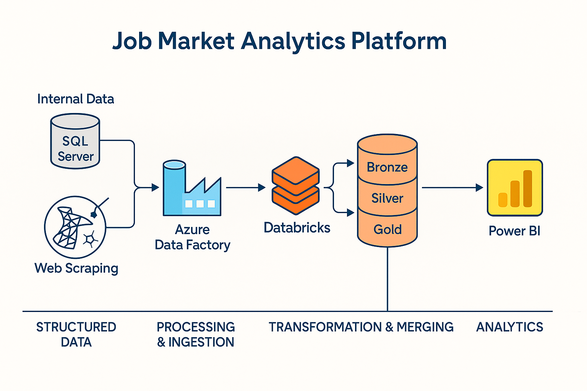

# 📊 Job Market Analytics Platform

A comprehensive hybrid data engineering project designed to analyze job market trends by integrating internal structured data from **SQL Server** with external job postings scraped from platforms like **SEEK**. This project leverages a **Metadata-Driven Architecture** orchestrated in **Azure Data Factory**, processed and transformed in **Databricks**, and visualized through insightful dashboards in **Power BI**.

---

## 📌 Project Overview

This project showcases the development of a complete **Modern Data Platform** focused on providing valuable insights into job market dynamics across major Australian cities, including Perth, Sydney, and Melbourne. By seamlessly combining internal HR data with publicly available job advertisements, the platform enables a holistic understanding of recruitment trends and market demands. The use of a metadata-driven approach ensures scalability, maintainability, and automation of the data ingestion pipelines.

---

## 🧱 Architecture Overview

---

## 🛠️ Technologies Used

This project utilizes a suite of cutting-edge technologies across different layers of the data platform:

| Layer                     | Tools / Services                             |
| :-------------------------- | :------------------------------------------- |
| **Data Source** | SQL Server (On-Prem), Web Scraping (Python) |
| **Orchestration** | Azure Data Factory (ADF)                     |
| **Transformation** | Azure Databricks (Bronze → Silver → Gold)    |
| **Storage** | Delta Lake on Azure Data Lake                |
| **Visualization** | Power BI                                   |
| **Control** | Metadata-Driven Ingestion Table (SQL)        |
| **Version Control** | GitHub                                     |

---

## 📅 Use Case Description

This platform addresses several key use cases:

* **Internal Job Analytics:** Analyze internal job openings based on departments and geographical locations.
* **External Market Analysis:** Scrape and analyze external job listings from SEEK, categorized by city, job title, and summary.
* **Comparative Insights:** Combine and enrich internal and external datasets to gain comparative insights into the job market.
* **Automated Data Ingestion:** Implement metadata-driven automation for scalable and efficient data ingestion pipelines.

---

## 🧩 SQL Server Data Warehouse

The project leverages a SQL Server Data Warehouse with the following schemas and tables:

* `HRDW.DimDepartment`
* `HRDW.DimLocation`
* `HRDW.FactJobOpening`
* `HRDW.IngestionControl`
* `HRDW.Bronze_WebJobs`

✅ The database is pre-populated with sample data encompassing job roles, departments, and cities for demonstration purposes.

---

## 🧪 Azure Data Factory (ADF)

The Azure Data Factory pipeline is designed with a metadata-driven approach, utilizing the following activities:

* **Lookup Activity:** Retrieves ingestion metadata from the `HRDW.IngestionControl` table.
* **ForEach Activity:** Iterates through the configured data sources based on the metadata.
* **Switch Activity:** Dynamically handles the logic for different `SourceType` values (e.g., SQL or WEB).

**Triggers:**

* `PL_Copy_WebJobs_To_SQL`: Executes the Python web scraping script to ingest data into the `Bronze_WebJobs` table.
* The pipeline utilizes parameters defined in the `HRDW.IngestionControl` table for dynamic configuration.

---

## 🔁 Web Scraping (Python + Seek)

The web scraping component utilizes a Python script (`web_scrape_seek.py`) to extract job posting data from SEEK.

* **Inputs:** Configuration parameters (cities, keywords) are dynamically retrieved from the `IngestionControl` table in JSON format.
* **Output:** The scraped data is loaded into the `HRDW.Bronze_WebJobs` SQL table.
* **Parsed Fields:**
    * `JobTitle`
    * `Company`
    * `Location`
    * `City`
    * `Summary`
    * `Link`

---

## 🔁 Databricks (Bronze → Silver → Gold)

Azure Databricks is used for data processing and transformation, following a Medallion architecture:

* **Bronze Layer:** Stores raw data ingested from both SQL Server and the web scraping process.
* **Silver Layer:** Contains cleaned and transformed job posting data, ready for further analysis.
* **Gold Layer:** Provides aggregated and joined datasets optimized for reporting and analysis in Power BI.

---

## 📊 Power BI Dashboard

The Power BI dashboard provides interactive visualizations and insights into the job market data:

* **Key Visuals:**
    * Comparison of Open vs. Closed Positions by City.
    * Analysis of Market Job Postings versus Internal Postings.
    * Frequency analysis of key skills mentioned in external job postings.
    * Time-series analysis of job opening trends.
* **Data Connectivity:** The dashboard connects directly to the Gold Layer in Databricks using either the SQL Analytics endpoint or Delta Sharing for efficient data retrieval.

---
---

## ⚙️ Metadata Control Table

CREATE TABLE HRDW.IngestionControl (
    SourceName NVARCHAR(100),
    SourceType NVARCHAR(50),
    IsActive BIT,
    TargetTable NVARCHAR(100),
    LastIngested DATETIME,
    Parameters NVARCHAR(MAX)
);
✅ Controls all ingestion jobs.
📦 Makes the pipeline scalable, modular, and automated.

---

## 💡 Key Learnings
Hybrid integration of internal SQL and external data

Metadata-driven orchestration with ADF

Bronze-Silver-Gold modeling using Delta Lake

End-to-end GitHub portfolio-ready project

---

## 🚀 Getting Started
Prerequisites
Azure Subscription

SQL Server (Local or Azure SQL DB)

Databricks Workspace

Power BI Desktop

Python (with requests, beautifulsoup4)

Steps
Clone the repo:

git clone https://github.com/raomohsin54/job-market-analytics.git
cd job-market-analytics
Run SQL scripts from data-ingestion folder to create schema and tables.

Set up ADF pipeline using metadata-driven-adf.json.

Configure Databricks and execute notebooks under databricks/.

Open Power BI file and update dataset connection.

---

## 📬 Contact
Author: Mohsin Mukhtiar
📍 Perth, WA | 💼 BI Developer | 📧 mohsin@example.com
